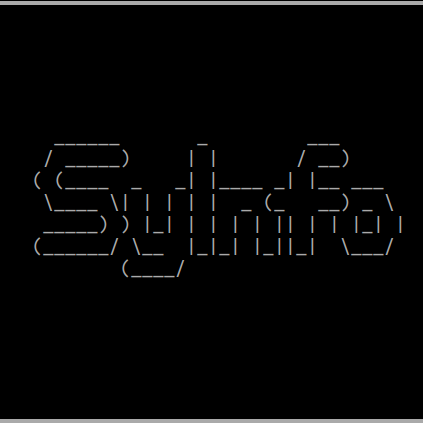

# SyInfo - Simple System Information Library
<p align="center">
  
</p>

[](https://badge.fury.io/py/syinfo)
[](https://pypi.org/project/syinfo/)

A simple, well-designed Python library for gathering system information including hardware specifications, network configuration, real-time system monitoring, and analysis utilities (log search, package inventory, health checks).

## Key Features

### Device Information
- **CPU Details**: Model, cores, frequency, usage statistics
- **Memory Analysis**: RAM, swap, detailed memory mapping
- **Storage Info**: Disk usage, I/O statistics, filesystem details
- **GPU Detection**: NVIDIA, AMD, Intel graphics cards
- **Device Identification**: Manufacturer, model, serial numbers

### Network Capabilities  
- **Interface Detection**: All network adapters with detailed info
- **Connectivity Analysis**: Public/private IP, DNS, gateways
- **Device Discovery**: Scan and identify devices on local network
- **Network I/O Statistics**: Real-time and historical data
- **WiFi Information**: SSID, signal strength, encryption

### System Monitoring (New!)
- **Real-time Monitoring**: CPU, memory, disk, and network tracking
- **Customizable Intervals**: 1 second to hours, configurable duration
- **JSON Export**: Perfect for scripting and automation with jq
- **Performance Analytics**: Averages, peaks, and trend analysis
- **Non-blocking**: Background monitoring with graceful interruption

### Powerful CLI Interface + Analysis (New!)
- **Flag-based Commands**: Easy scripting (`syinfo -npj -t 10 | jq '.summary'`)
- **JSON Output**: Native jq compatibility for data processing
- **Monitoring Support**: Real-time system performance tracking
- **Flexible Options**: Combine flags for exactly what you need
- **Log Analysis**: `--logs` with filters (`--text`, `--level`, `--process`, `--regex`, `--hours`, `--limit`)
- **Package Inventory**: `--packages` with `--manager` and `--name` filters
- **Health/Search**: `--health` (24h errors/warnings), `--search "term"` (logs + packages)

### Advanced Logging (New!)
- **Production-Ready**: Sophisticated singleton logger with advanced features
- **Incident Tracking**: Automatic numbering of warnings and errors
- **Enhanced Tracebacks**: Beautiful, readable error traces with file context
- **Multiple Outputs**: Console, files, and system log (syslog) simultaneously
- **Runtime Configuration**: Dynamic log levels, handler management, statistics
- **Platform-Aware**: Auto-detects syslog paths for Linux, macOS, and Windows

## Installation

```bash
# Basic installation
pip install syinfo

# With network discovery features
pip install syinfo[network]

# Full installation (all features)
pip install syinfo[full]
```

### From source (local)

```bash
# Clone and install in editable mode (recommended for development)
git clone https://github.com/MR901/syinfo.git
cd syinfo
python -m venv .venv && source .venv/bin/activate  # optional but recommended
pip install -e '.[full]'   # or: pip install -e .

# Alternatively, install directly from a local path
pip install /path/to/syinfo  # installs from sdist/wheel if present
pip install -e /path/to/syinfo  # editable install from local directory

# Build wheel/sdist locally (optional)
python -m build
pip install dist/syinfo-*.whl
```

## Quick Start

### Basic Usage

```python
import syinfo

# Get comprehensive system information
info = syinfo.get_system_info()
print(f"System: {info['system_name']}")
print(f"CPU: {info['cpu_model']} ({info['cpu_cores']} cores)")
print(f"Memory: {info['total_memory']} ({info['memory_usage_percent']:.1f}% used)")
```

### Hardware Information

```python
# Get detailed hardware info
hardware = syinfo.get_hardware_info()

print("CPU Information:")
print(f"  Model: {hardware['cpu']['model']}")
print(f"  Cores: {hardware['cpu']['cores_physical']} physical")
print(f"  Usage: {hardware['cpu']['usage_percent']:.1f}%")

print("Memory Information:")  
print(f"  Total: {hardware['memory']['total']}")
print(f"  Available: {hardware['memory']['available']}")
print(f"  Usage: {hardware['memory']['usage_percent']:.1f}%")
```

### Network Discovery

```python
# Discover devices on network
devices = syinfo.discover_network_devices(timeout=10)
print(f"Found {len(devices)} devices:")

for device in devices:
    print(f"  {device['ip']:15} - {device['hostname']} ({device['vendor']})")
```

### System Monitoring

```python
# Create a system monitor
monitor = syinfo.create_system_monitor(interval=5, output_path="./monitoring")

# Start monitoring for 60 seconds
monitor.start(duration=60)
import time
time.sleep(61)
results = monitor.stop()

print(f"Average CPU Usage: {results['summary']['cpu_avg']:.1f}%")
print(f"Peak Memory Usage: {results['summary']['memory_peak']:.1f}%")
print(f"Data Points Collected: {results['total_points']}")
```

## CLI Interface - Flag-Based Commands

### Device Information
```bash
# Device/hardware information
syinfo -d

# With JSON output
syinfo -dj | jq '.cpu_info.model'
```

### Network Operations
```bash
# Network information
syinfo -n -t 10          # Scan network for 10 seconds

# Network with device info
syinfo -s -t 15          # Combined system info, 15-second network scan

# JSON output for parsing
syinfo -nj -t 5 | jq '.network_devices | length'
```

### System Monitoring (New!)
```bash
# Monitor system for 30 seconds, 5-second intervals
syinfo -m -t 30 -i 5

# JSON monitoring data
syinfo -mpj -t 60 -i 10 | tail -1 | jq '.summary'

# Extract specific metrics
syinfo -mpj -t 120 -i 15 | tail -1 | jq -r '.summary.cpu_avg'

# Visualize monitoring JSONL (Python)
from syinfo.monitoring.visualization import plot_with_matplotlib
plot_with_matplotlib("./monitoring/monitor-YYYYMMDD-HHMMSS.jsonl")
```

### Advanced CLI Usage
```bash
# Disable output, just get JSON
syinfo -dpj > device_info.json

# Network scan without vendor lookup (faster)
syinfo -noj -t 5

# Monitor and process with jq
syinfo -mpj -t 60 -i 10 | tail -1 | jq '.data_points[].cpu_percent | max'

# Complex monitoring workflows
CPU_AVG=$(syinfo -mpj -t 30 -i 5 | tail -1 | jq -r '.summary.cpu_avg')
if (( $(echo "$CPU_AVG > 80" | bc -l) )); then
  echo "High CPU usage detected: $CPU_AVG%"
fi
```

## CLI Flag Reference

| Flag | Long Flag | Description |
|------|-----------|-------------|
| `-d` | `--device` | Show device/hardware information |
| `-n` | `--network` | Show network information and scan devices |
| `-s` | `--system` | Show combined device and network information |
| `-m` | `--monitor` | **Start system monitoring** |
| `-l` | `--logs` | Query system logs (use text/level/process/regex/hours/limit) |
| `-P` | `--packages` | List installed packages (use manager/name) |
| `-H` | `--health` | Show 24h health report |
| `-S` | `--search` | Cross-surface search (logs + packages) |
| `-t` | `--time` | Duration in seconds (network scan or monitoring) |
| `-i` | `--interval` | **Monitoring interval in seconds (default: 5)** |
| `-p` | `--disable-print` | Suppress formatted output |
| `-j` | `--return-json` | Output as JSON |
| `-o` | `--disable-vendor-search` | Skip vendor lookup (faster network scans) |

## System Monitoring Features

### Real-time Performance Tracking
- **CPU Usage**: Per-core and overall utilization
- **Memory Statistics**: Usage, available, swap information
- **Disk I/O**: Read/write operations and usage percentages
- **Network Activity**: Bytes and packets sent/received

### JSON Data Structure
```json
{
  "total_points": 12,
  "data_points": [
    {
      "timestamp": "2025-09-14T02:20:42.029017",
      "cpu_percent": 7.8,
      "memory_percent": 68.2,
      "disk_percent": 82.8,
      "network_io": {
        "bytes_sent": 3301001170,
        "bytes_recv": 4409283972,
        "packets_sent": 3556700,
        "packets_recv": 5418377
      }
    }
  ],
  "summary": {
    "duration_seconds": 60,
    "cpu_avg": 5.3,
    "cpu_max": 8.3,
    "memory_avg": 68.2,
    "memory_peak": 68.4,
    "disk_avg": 82.8,
    "start_time": "2025-09-14T02:20:42.029017",
    "end_time": "2025-09-14T02:21:42.029017"
  }
}
```

### Monitoring Use Cases
```bash
# Server performance monitoring
syinfo -mpj -t 3600 -i 60 | tail -1 > hourly_stats.json

# Quick system check
syinfo -m -t 10 -i 2

# CPU spike detection
syinfo -mpj -t 300 -i 5 | tail -1 | jq '.data_points[] | select(.cpu_percent > 90)'

# Network throughput analysis
syinfo -mpj -t 120 -i 10 | tail -1 | jq '.data_points | [.[0], .[-1]] | .[1].network_io.bytes_sent - .[0].network_io.bytes_sent'
```

## Advanced Logging

SyInfo includes a production-ready logging system:

```python
from syinfo import Logger, LoggerConfig
import logging

# Basic usage
logger = syinfo.Logger.get_logger()
logger.info("Application started")

# Advanced configuration
config = LoggerConfig(
    log_level=logging.DEBUG,
    log_files=["app.log", "debug.log"],
    output_to_stdout=True,
    verbose_logs=True,           # Include function names and line numbers
    enable_incident_counting=True, # Number warnings/errors
    enable_traceback=True,       # Beautiful formatted tracebacks
    enable_syslog=True           # System log integration
)

logger = Logger.get_logger(config)
logger.warning("This will be numbered")  # (incident #1) This will be numbered

# Runtime management
logger_instance = syinfo.Logger.get_instance()
stats = logger_instance.get_stats()
print(f"Warnings: {stats['warning_count']}, Errors: {stats['error_count']}")
```

## Error Handling

```python
from syinfo.exceptions import SystemAccessError, DataCollectionError

logger = syinfo.Logger.get_logger()

try:
    info = syinfo.get_system_info()
    logger.info("System info collected successfully")
except SystemAccessError as e:
    logger.error(f"Permission error: {e}")  # Includes traceback if enabled
except DataCollectionError as e:
    logger.error(f"Data collection failed: {e}")
```

## Performance & Reliability

### Benchmarks
- **Data Collection**: < 2 seconds for complete system scan
- **Memory Usage**: < 50MB peak memory consumption  
- **Network Scan**: < 15 seconds for typical home network
- **Monitoring Overhead**: < 1% CPU during continuous monitoring

## Development

### Setup
```bash
git clone https://github.com/MR901/syinfo.git
cd syinfo
python -m venv venv
source venv/bin/activate  # or `venv\Scripts\activate` on Windows
pip install -e .[dev,full]
```

### Testing
```bash
# Run tests
pytest

# Run with coverage
pytest --cov=syinfo --cov-report=html

# Test monitoring functionality
python -c "import syinfo; m=syinfo.create_system_monitor(1); m.start(5); import time; time.sleep(6); print(m.stop())"
```

## Examples

Check out the organized [examples/](examples/) directory:
- Basic: `examples/basic/` (device, system, network, export)
- Analysis: `examples/analysis/` (logs, packages, system health/search)
- Monitoring: `examples/monitoring/` (simple monitoring)
- CLI: `examples/cli/USAGE.md`

Run everything:

```bash
python -m examples.run_all
```

## License

This project is licensed under the MIT License - see the [LICENSE](LICENSE) file for details.

## Support

- **Issues**: [GitHub Issues](https://github.com/MR901/syinfo/issues)  
- **Email**: mohitrajput901@gmail.com
- **GitHub**: [https://github.com/MR901/syinfo](https://github.com/MR901/syinfo)