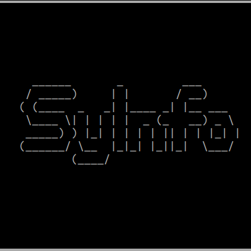

SyInfo Documentation
===================

**System Information & Monitoring Tool**

SyInfo is a comprehensive Python library and command-line tool for system information gathering and advanced system monitoring. It provides both legacy system information capabilities and modern monitoring features with data analysis and visualization.

.. toctree::
   :maxdepth: 2
   :caption: Contents:

   installation
   user_guide/index
   api/index
   cli/index
   developer/index

Quick Start
----------

**Installation**

.. code-block:: bash

   # Complete installation (recommended)
   git clone https://github.com/MR901/syinfo.git
   cd syinfo
   sudo chmod +x install
   sudo ./install
   pip install .
   
   # Basic installation
   pip install syinfo

**Basic Usage**

.. code-block:: python

   from syinfo.core import DeviceInfo, NetworkInfo, SysInfo
   
   # Get device information
   device_info = DeviceInfo.get_all()
   
   # Get network information
   network_info = NetworkInfo.get_all()
   
   # Get combined system information
   system_info = SysInfo.get_all()

**Command Line**

.. code-block:: bash

   # Get hardware information
   python -m syinfo info device
   
   # Get network information
   python -m syinfo info network
   
   # Get complete system information
   python -m syinfo info system
   
   # Start monitoring
   python -m syinfo monitor start

Key Features
-----------

* **Hardware Information**: Detailed CPU, memory, disk, GPU, and device manufacturer information
* **Network Information**: Network interfaces, WiFi details, connected devices, and network statistics
* **Software Information**: Operating system details, kernel information, and software configuration
* **Real-time Monitoring**: CPU, memory, disk, network, and process monitoring
* **Data Analysis**: Trend analysis and anomaly detection
* **Visualization**: Charts and dashboards for system metrics
* **Automated Scheduling**: Cron job integration for continuous monitoring
* **Backward Compatibility**: Full compatibility with existing SyInfo usage
* **Dual Mode**: Both Python library and CLI tool support

Installation Options
-------------------

* **Basic Installation**: Core system information features
* **Full Installation**: Includes monitoring and analysis features
* **Development Installation**: For contributing to the project

.. code-block:: bash

   # Basic installation
   pip install syinfo
   
   # Full installation with monitoring features
   pip install syinfo[monitoring]
   
   # Development installation
   git clone https://github.com/MR901/syinfo.git
   cd syinfo
   pip install -e .

System Requirements
------------------

* **Python**: 3.7 or higher
* **Operating System**: Linux (primary), macOS, Windows
* **Dependencies**: 
  - Core: psutil, pyyaml
  - Full: Cython, getmac, GPUtil, scapy, tabulate, requests

Getting Help
-----------

* **Documentation**: This documentation
* **GitHub**: https://github.com/MR901/syinfo
* **Email**: mohitrajput901@gmail.com
* **Issues**: https://github.com/MR901/syinfo/issues

Indices and tables
==================

* :ref:`genindex`
* :ref:`modindex`
* :ref:`search` 