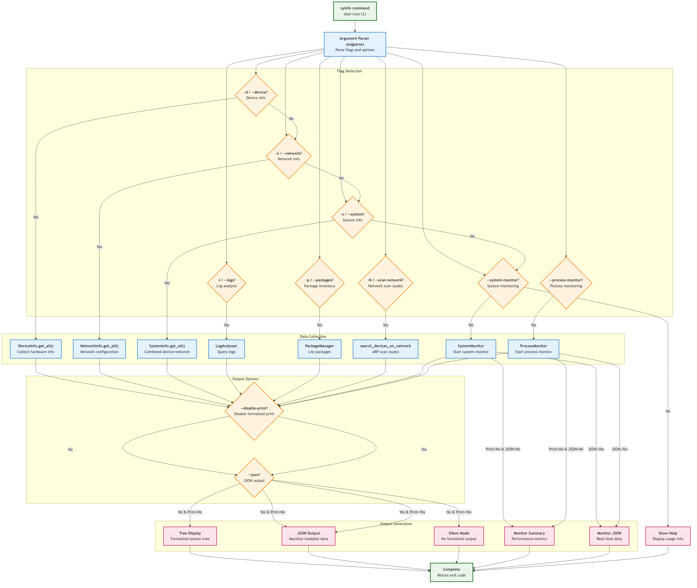
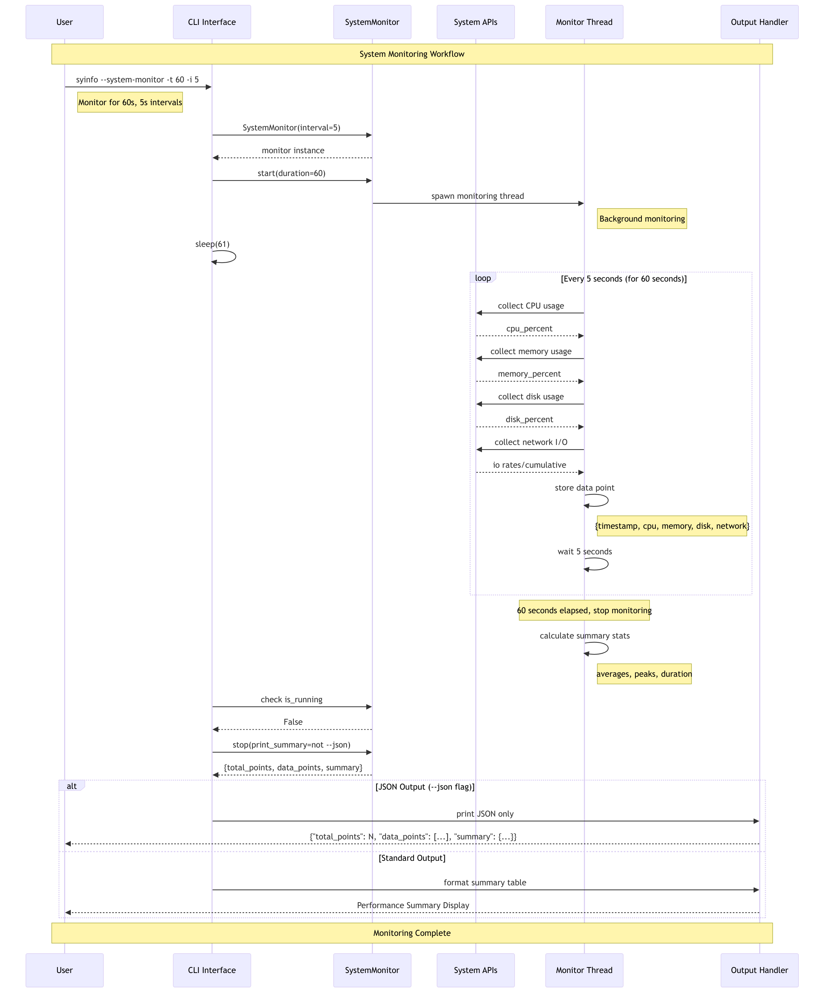
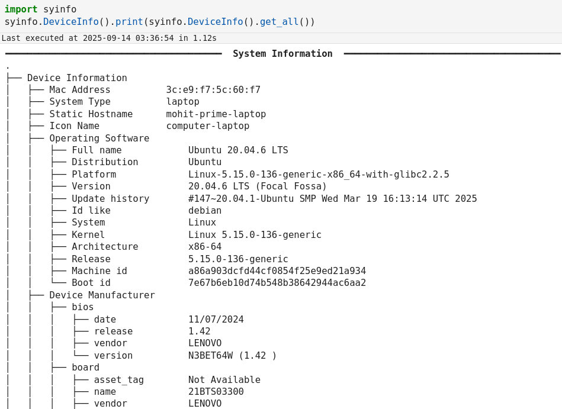
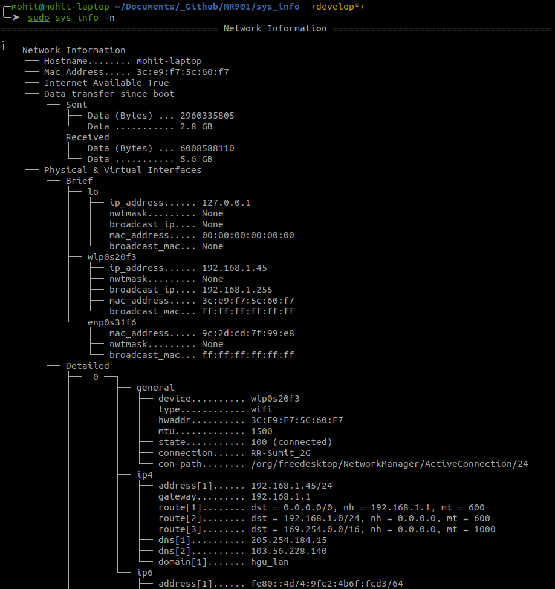

Usage
=====

Install
-------

.. code-block:: bash

   pip install syinfo

From source:

.. code-block:: bash

   git clone https://github.com/MR901/syinfo.git
   cd syinfo
   python3 -m venv .venv && source .venv/bin/activate
   pip install -e '.[dev]'

Quickstart
----------

.. code-block:: python

   from syinfo import DeviceInfo, SystemInfo

   # Device information
   device = DeviceInfo.get_all()
   print('CPU model:', device.get('cpu_info', {}).get('design', {}).get('model name'))

   # Combined system info (device + network summary)
   system = SystemInfo.get_all(search_period=0, search_device_vendor_too=False)
   print('Hostname:', system.get('dev_info', {}).get('static_hostname'))

CLI - Flag-Based Commands
-------------------------

The CLI uses a simple flag-based interface:

Device Information:

.. code-block:: bash

   syinfo -d                      # Device/hardware information
   syinfo -d --json | jq '.cpu_info.cores'  # JSON output

Network Operations:

.. code-block:: bash

   syinfo -n -t 10               # Network info (summary)
   syinfo -s                     # Combined system info
   syinfo -n --json | jq '.'     # Network info as JSON

System Monitoring:

.. code-block:: bash

   syinfo --system-monitor -t 30 -i 5          # Monitor for 30s, 5s interval
   syinfo --system-monitor --json -t 60 -i 10  # JSON output
   syinfo --system-monitor --json -t 120 -i 15 | tail -1 | jq '.summary'

Process Monitoring:

.. code-block:: bash
   syinfo --process-monitor --filter python --json | jq '.data_points[0].processes'
   syinfo --process-monitor --filter firefox -t 10 -i 1
   

Log Analysis:

.. code-block:: bash

   # Regex search for errors (limit results)
   syinfo -l --pattern 'error|fail' --limit 50 --json | jq '.[0]'

Package Inventory:

.. code-block:: bash

   # List pip django* and apt python*
   syinfo -p --name slack
   syinfo -p --name sublime --json
   syinfo -p --manager pip --name pandas

Network Scan (sudo):

.. code-block:: bash

   sudo syinfo -N --json | jq 'keys | length'

JSON Output & Printing:

.. code-block:: bash

   syinfo -d --json > device_info.json
   syinfo --system-monitor --json -t 300 -i 30 | tail -1 > monitoring_data.json

CLI Flag Reference
------------------

========== =========================== =============================================
Flag       Long Flag                   Description
========== =========================== =============================================
``-d``     ``--device``                Show device/hardware information
``-n``     ``--network``               Show network information
``-s``     ``--system``                Show combined device and network information
``-t``     ``--time``                  Duration in seconds (monitoring/network scan)
``-i``     ``--interval``              Monitoring interval in seconds (default: 5)
``-l``     ``--logs``                  Analyze and search logs (use --pattern, --level, --limit)
``-p``     ``--packages``              Analyze installed packages (use --manager, --name)
``-N``     ``--scan-network``          Scan network for devices (requires sudo)
          ``--system-monitor``         Start real-time system monitoring
          ``--process-monitor``        Start process-specific monitoring
          ``--json``                   Output results as JSON
          ``--disable-print``          Disable formatted output (JSON only)
          ``--disable-vendor-search``  Skip vendor lookup (faster network scans)
========== =========================== =============================================

Monitoring Examples
-------------------

System monitoring workflow:

Basic Monitoring:

.. code-block:: bash

   # Monitor for 60 seconds with 10-second intervals
   syinfo --system-monitor -t 60 -i 10
   
   # Quick 30-second system check
   syinfo --system-monitor -t 30 -i 5

JSON Monitoring Data:

.. code-block:: bash

   # Get monitoring data as JSON
   syinfo --system-monitor --json -t 120 -i 10 | tail -1 | jq '.summary'
   
   # Extract CPU average
   syinfo --system-monitor --json -t 60 -i 5 | tail -1 | jq -r '.summary.cpu_avg'
   
   # Count data points collected
   syinfo --system-monitor --json -t 30 -i 2 | tail -1 | jq '.total_points'

Performance Analysis:

.. code-block:: bash

   # Save monitoring data to file
   syinfo --system-monitor --json -t 300 -i 30 | tail -1 > performance_data.json
   
   # Monitor and alert on high CPU
   CPU_AVG=$(syinfo --system-monitor --json -t 60 -i 10 | tail -1 | jq -r '.summary.cpu_avg')
   if (( $(echo "$CPU_AVG > 80" | bc -l) )); then
     echo "High CPU usage: $CPU_AVG%"
   fi

Python API
----------

.. code-block:: python

   from syinfo import (
       DeviceInfo, SystemInfo, NetworkInfo, SystemMonitor, ProcessMonitor,
       Logger, LoggerConfig
   )
   from syinfo.core.search_network import search_devices_on_network
   from syinfo.analysis.logs import LogAnalyzer, LogAnalysisConfig
   from syinfo.analysis.packages import PackageManager, PackageManagerType
   
   # Get system information
   info = SystemInfo.get_all(search_period=0, search_device_vendor_too=False)
   hardware = DeviceInfo.get_all()
   
   # Network information and device discovery
   network = NetworkInfo.get_all(search_period=0, search_device_vendor_too=False)
   devices = search_devices_on_network(time=5, search_device_vendor_too=False)
   
   # Create and use system monitor
   monitor = SystemMonitor(interval=5)
   monitor.start(duration=60)
   import time; time.sleep(61)
   results = monitor.stop()
   print(f"CPU Average: {results['summary']['cpu_avg']:.1f}%")
   
   # Process monitoring
   proc_monitor = ProcessMonitor(filters=["python"], interval=10)
   proc_monitor.start(duration=30)
   time.sleep(31)
   proc_results = proc_monitor.stop()
   
   # Log analysis
   log_config = LogAnalysisConfig()
   analyzer = LogAnalyzer(log_config)
   log_entries = analyzer.query_logs(text_filter="error", limit=10)
   
   # Package management
   pm = PackageManager()
   packages = pm.list_packages(name_filter="python", manager=PackageManagerType.APT)
   
   # Advanced logging
   logger_config = LoggerConfig(
       log_level=20,  # INFO level
       output_to_stdout=True,
       enable_incident_counting=True
   )
   logger = Logger.get_logger(logger_config)
   logger.info("Application started with syinfo")

Screenshots (optional)
----------------------

Advanced/Dev
------------

- Robust GPU strategy: tries GPUtil, then nvidia-smi, then lspci; prints normalized table.
- Export helpers: JSON/YAML via ``syinfo.utils.export.export_data``.
- Programmatic: use ``SystemInfo.get_all(...)`` for system data.
- Real-time monitoring: use ``SystemMonitor(interval=N)`` for system tracking.
- Tests & linting (if dev extras installed)::

 .. code-block:: bash

    pytest -q
    python -m ruff check --fix . && python -m black .

Advanced Features
-----------------

Logging
~~~~~~~

SyInfo includes a sophisticated logging system with advanced features:

.. code-block:: python

   from syinfo import Logger, LoggerConfig
   import logging
   
   # Configure advanced logging
   config = LoggerConfig(
       log_level=logging.INFO,
       log_files=["app.log"],
       enable_incident_counting=True,
       enable_traceback=True,
       enable_syslog=True
   )
   
   logger = Logger.get_logger(config)
   logger.info("Application started")

For complete logging documentation, see :doc:`logging`.
